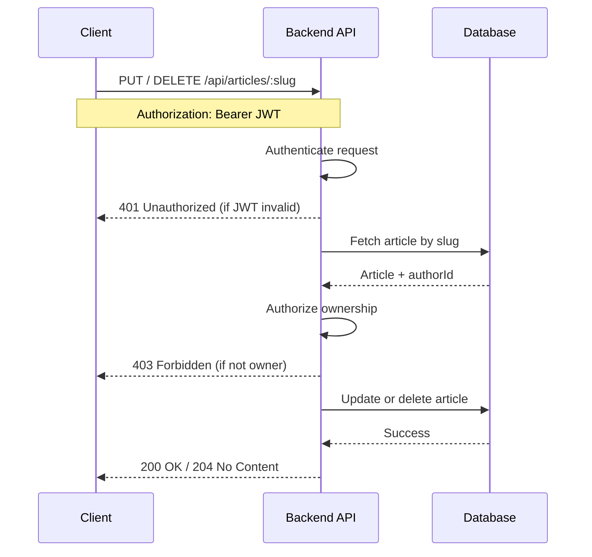

# Application Security Case Study
## Authorization and Threat Modeling - RealWorld Node Express API

---

## Target Project

Node Express RealWorld Example App  
https://github.com/gothinkster/node-express-realworld-example-app

Analyzed Commit  
30b68e1e881462b2f4164ea09ab4c4f5699c7b0b

---

## Scope

This case study analyzes server side authorization and business logic controls for the following REST API features:

- Edit Article, PUT /api/articles/:slug
- Delete Article, DELETE /api/articles/:slug

Out of scope:
- Frontend validation  
- UI logic  
- Performance considerations  

---

## High Level Request Flow

This flow illustrates how authentication and authorization are enforced before any state changing operation and highlights the main trust boundaries.

---

## Feature 1: Edit Article

### Endpoint
PUT /api/articles/:slug

### Code References

[Controller](https://github.com/gothinkster/node-express-realworld-example-app/blob/30b68e1e881462b2f4164ea09ab4c4f5699c7b0b/src/app/routes/article/article.controller.ts#L101-L122)

[Service](https://github.com/gothinkster/node-express-realworld-example-app/blob/30b68e1e881462b2f4164ea09ab4c4f5699c7b0b/src/app/routes/article/article.service.ts#L289-L383)

---

### Assets

- Article content  
- Article ownership  
- User identity  
- JWT access token  

---

### Actors

- Anonymous user  
- Authenticated user  
- Article owner

---
### Trust Boundaries

- Client to Backend API  
- Backend API to Database  

All data received from the client is treated as untrusted input.

### Authorization Logic

Authorization is enforced at the service layer by validating article ownership.

The application compares the authenticated user ID extracted from the JWT with the article author ID retrieved from the database.

If the values do not match, the request is rejected with a 403 Forbidden response.

Authorization decisions are implemented close to the business logic, reducing the risk of trusting client side input.

---

### Repudiation Risk

Risk  
Article updates are performed without an explicit audit trail.

Impact  
It is not possible to reliably determine who modified an article and when the change occurred.

Mitigation  
Introduce audit logging for article updates, including user ID, article identifier, timestamp, and action type.

---

## Feature 2: Delete Article

### Endpoint
DELETE /api/articles/:slug

### Code References

[Controller](https://github.com/gothinkster/node-express-realworld-example-app/blob/30b68e1e881462b2f4164ea09ab4c4f5699c7b0b/src/app/routes/article/article.controller.ts#L124-L141)

[Service](https://github.com/gothinkster/node-express-realworld-example-app/blob/30b68e1e881462b2f4164ea09ab4c4f5699c7b0b/src/app/routes/article/article.service.ts#L385-L414)

---

### Assets

- Article record  
- Article ownership  
- Database integrity  
- User identity  

---

### Actors

- Anonymous user  
- Authenticated user  
- Article owner

---

### Trust Boundaries

- Client to Backend API  
- Backend API to Database  

All data received from the client is treated as untrusted input.

---

### Authorization Logic

The delete operation enforces the same ownership validation pattern used in the edit feature.

If the authenticated user is not the article author, the request is rejected with a 403 Forbidden response.

This prevents unauthorized deletion of content.

---

### Repudiation Risk

Risk  
Article deletion is performed without audit logging.

Impact  
Destructive actions cannot be attributed to a specific user, which affects accountability and incident response.

Mitigation  
Log delete actions with user ID, article identifier, timestamp, and action type.

---

## Comparison Between Features

| Aspect | Edit Article | Delete Article |
|------|-------------|---------------|
| Authentication required | Yes | Yes |
| Ownership enforced | Yes | Yes |
| Authorization location | Service layer | Service layer |
| Centralized authorization | No | No |
| Business impact | Medium | High |
| Audit logging | No | No |

---

## Security Assessment

No Broken Access Control vulnerabilities were identified during the analysis of the selected features.

Authorization is correctly enforced server side through explicit ownership validation.

The primary security gap identified is the absence of audit logging, which introduces repudiation risk for both update and delete operations.

---

## Recommendations

- Add audit logging for update and delete actions  
- Introduce a centralized authorization helper to enforce consistent access control decisions  
- Apply rate limiting to destructive endpoints  
- Consider soft delete for critical resources  

---

## Summary

This case study demonstrates how server side authorization and business logic controls are implemented in a production style open source application.

The authorization design is sound, while improvements in auditing and authorization centralization would further strengthen security posture.
